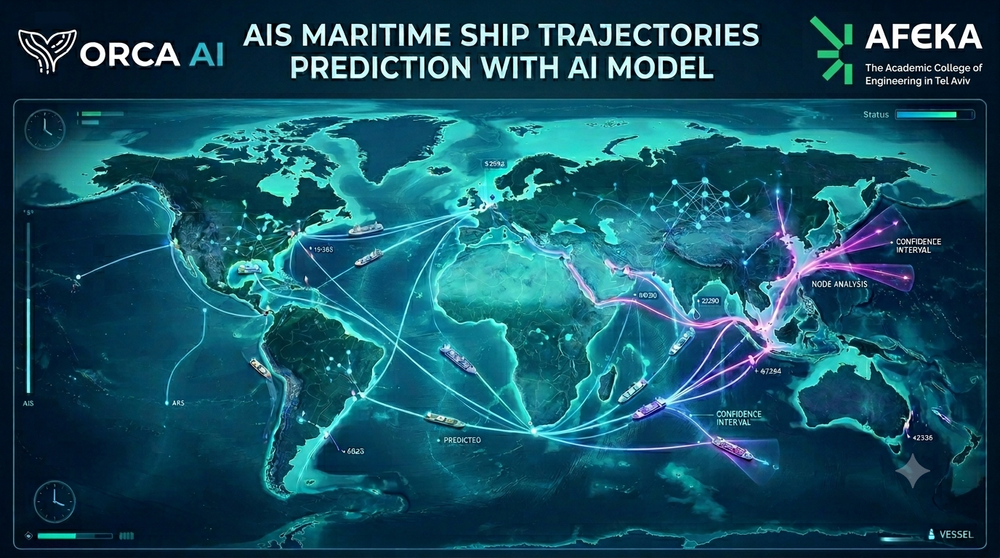
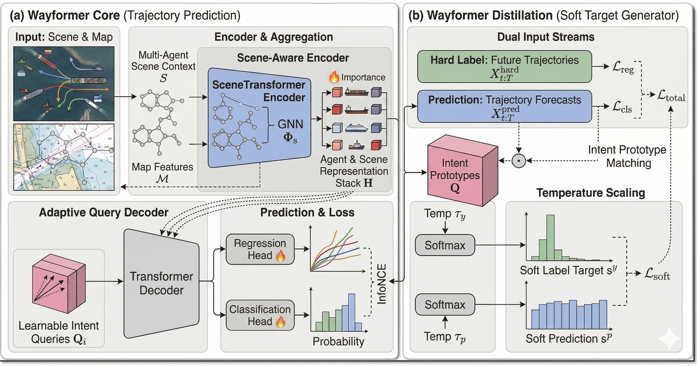
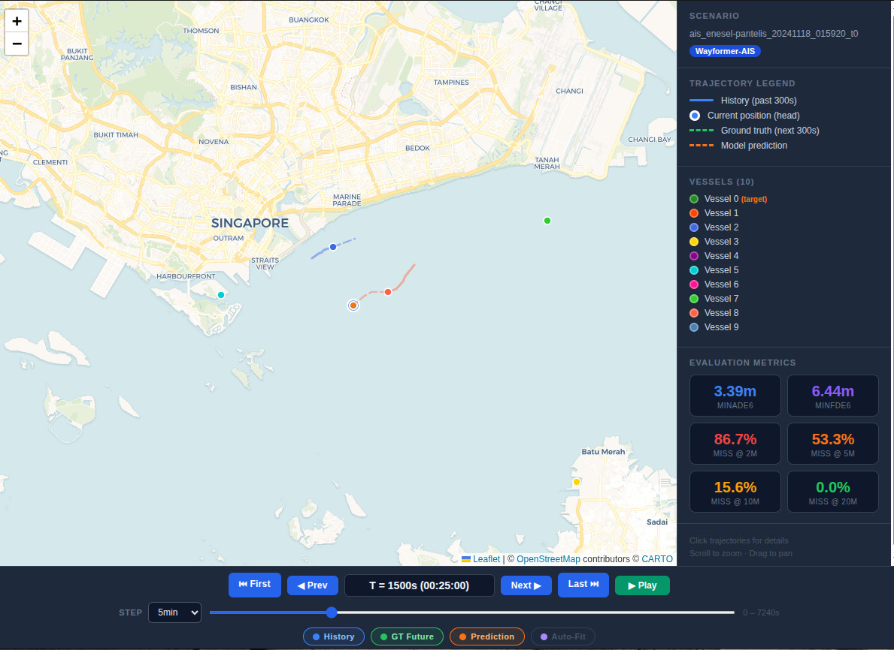

<div align="center">



# Multi-Agent Social Interaction AIS Trajectory Prediction: Comparing Methods

**A unified benchmark for maritime vessel trajectory prediction**

MSc Intelligent Systems · School of Software Engineering · Afeka College of Engineering, Tel Aviv

**Author:** Aviv Salomon
**Supervisor:** Dr. Sharon Yalov-Handzel — Head of the Master's Program, School of Software Engineering
**Industry Advisor:** Mr. Anton (Yurkov) Feingold — AI Team Lead, Orca AI

</div>

---

## Overview

This repository contains the code, configurations, and evaluation tooling for an MSc thesis on
**multi-agent vessel trajectory prediction from AIS data**.

The maritime sector carries over 80 % of world trade by volume. Inside an autonomous or
decision-support bridge system, trajectory prediction is the bridge between *perception* (detecting
nearby vessels via AIS, radar, camera) and *planning* (computing a safe, COLREG-compliant
manoeuvre). Constant-velocity extrapolation — the default fallback in most deployed systems —
breaks down exactly where it matters most: congested ports, narrow channels, and crossing or
overtaking encounters governed by the COLREGs.

**The problem this work addresses is not a new architecture, but the inability to compare existing
ones.** Every published AIS prediction model (TrAISformer, AIS-ACNet, GAT-LSTM, TPTrans, …) is
evaluated on a private regional dataset, with its own preprocessing, its own sampling rate, and its
own prediction horizon. The basic question — *does a transformer outperform a graph network for
vessel trajectory prediction, and by how much?* — cannot be answered from the literature as it
stands.

This work answers it by putting **five architectures under one identical experimental protocol**:
the same large-scale AIS dataset, the same preprocessing pipeline, the same train/validation/test
split, the same seed, and the same metrics.

> The codebase is built on top of [UniTraj](https://github.com/vita-epfl/UniTraj) (Feng et al.,
> ECCV 2024), a unified framework for **road-vehicle** trajectory prediction. This repository ports
> that framework to the maritime domain: AIS ingestion, ego-relative maritime scene construction,
> map-free model variants, and four additional maritime-domain architectures.

### Contributions

1. **AIS data pipeline** — a complete preprocessing toolkit for raw AIS CSV archives:
   deduplication, gap-aware interpolation, kinematics re-derivation, flat-Earth projection, and
   serialization into UniTraj-compatible maritime scenes.
2. **Unified maritime benchmark** — the first evaluation of multiple trajectory prediction
   architectures under identical conditions (shared split, preprocessing, and metrics) on a
   large-scale, multi-year, globally diverse AIS archive.
3. **Method comparison** — a systematic comparison of five approaches spanning four paradigms:
   least-squares extrapolation, autoregressive transformer, dilated causal CNN, graph attention +
   recurrence, and multi-agent attention.
4. **Reproducibility** — all code, configuration, split indices, and evaluation scripts are
   released so that the same protocol can be re-run on this or on any alternative AIS dataset.

---

## Problem Formulation

A maritime scene contains $N$ vessels observed simultaneously within a **12 nautical-mile (22 km)**
radius of the ego vessel. At each timestep $t$ (sampled at 1 Hz), vessel $i$ is described by

$$\mathbf{x}_i^t = (x,\; y,\; v_x,\; v_y) \in \mathbb{R}^4$$

where $(x, y)$ are ego-relative Cartesian coordinates in metres and $(v_x, v_y)$ the corresponding
velocity components in m/s. Given the joint past of all vessels, the task is to learn

$$f_\theta\big(\mathbf{X}^1, \ldots, \mathbf{X}^N\big) \longrightarrow \{\hat{\mathbf{Y}}_i\}_{i=1}^{N}$$

The prediction is **marginal**: an independent future distribution is produced for each vessel,
conditioned on the observed histories of *all* surrounding vessels. This captures social interaction
without requiring joint future inference.

| Setting | Value |
|---|---|
| Past horizon $T_{\text{past}}$ | 300 s (5 min) @ 1 Hz |
| Future horizon $T_{\text{future}}$ | 300 s (5 min) @ 1 Hz |
| Modes $K$ | 6 (Gaussian mixture, with mode probabilities $\pi_k$) |
| Max vessels per scene | 10 |
| Encounter radius | 12 nm (22 km) |

**Metrics.** `minADE`$_K$ (mean $\ell_2$ error of the best mode over all future steps),
`minFDE`$_K$ (error of the best mode at the final step), `Miss Rate @ {2, 5, 10, 20} m`, and
`Brier-FDE` $= \text{minFDE}_K + (1 - \pi_{k^*})^2$, which jointly rewards spatial accuracy and
calibrated confidence. All distances are in metres.

---

## Architecture

<div align="center">

</div>

**Wayformer-AIS**, the primary model of this study, adapts the Perceiver-based Wayformer
encoder–decoder (Nayakanti et al., 2022) from road vehicles to the sea.

**(a) Core.** Per-agent AIS features are projected to a $d_k = 256$ embedding with learnable agent-
and time-index positional encodings, flattened across agents and timesteps, and compressed by a
Perceiver **bottleneck encoder** ($N_{\text{enc}} = 192$ latent queries, $L_{\text{enc}} = 2$
cross-attention layers) into a fixed-size scene context — regardless of how many vessels are present
or how many observations are missing. A Perceiver **decoder** ($N_{\text{dec}} = 128$ output
queries, $L_{\text{dec}} = 8$ layers) turns learnable intent queries into $K = 6$ modes, each
carrying a regression head (bivariate Gaussian per future timestep) and a classification head (mode
probability). Training uses winner-takes-all NLL on the geometrically closest mode plus a
cross-entropy term on the mode probabilities.

**(b) Distillation branch.** An exploratory extension that supplements the hard future-trajectory
label with a soft target: intent-prototype matching between predictions and ground truth, with
temperature-scaled softmax distributions on both sides, contributing an additional
$\mathcal{L}_{\text{soft}}$ term aimed at better-calibrated mode probabilities. *This branch is
under investigation and is not part of the controlled five-model comparison.*

**Maritime adaptations.**

| Aspect | Road (original) | AIS (this work) |
|---|---|---|
| Map input | Road network / lane polylines | None (dummy zero tensor) |
| Coordinate frame | World absolute | Ego-relative (metres) |
| Max agents | 32 | 10 |
| Position scale | Scene-relative | 100 m |
| Velocity scale | km/h | m/s (÷ 20) |
| Agent feature dim | 39 | 39 (compatible) |

There are no lane graphs, traffic lights, or road topology at sea; vessel dynamics differ
qualitatively (long stopping distances, wind and current drift, slow turn rates), and encounters are
governed by COLREGs rather than yield signs.

---

## Compared Methods

All five models are trained and evaluated on the same split with seed `42`, and the best checkpoint
for each is selected by minimising `val/brier_fde`.

| Model | Paradigm | Social context | Modes | Config |
|---|---|---|---|---|
| **Baseline Linear** | OLS least-squares extrapolation | ✗ | 1 | `baseline_linear` |
| **TrAISformer** <sub>(Nguyen & Fablet, 2021)</sub> | GPT-style autoregressive transformer over quantised "fourhot" AIS tokens | ✗ | 6 (sampled rollouts) | `traisformer` |
| **AIS-ACNet** <sub>(Shin et al., 2024)</sub> | Dual-stream dilated causal CNN (GWNet backbone), auxiliary SOG/COG heads | ✗ | 1 | `ais_acnet` |
| **GAT-LSTM** <sub>(Zhao et al., 2023)</sub> | Graph attention over trajectory sub-segments + LSTM decoder | partial (graph) | 1 | `gat_lstm` |
| **Wayformer-AIS** <sub>(Nayakanti et al., 2022)</sub> | Perceiver bottleneck encoder–decoder, factorised agent–time attention | ✓ (full scene) | 6 (GMM) | `wayformer_ais` |

Each method required adaptation to the shared 5-minute / 1 Hz regime — for example, TrAISformer's
context window grows to 600 tokens (its original regime used 10-minute sampling); AIS-ACNet's
dilation schedule was extended to $[1, 2, 4, \ldots, 512]$ for a receptive field of 1024 timesteps;
and GAT-LSTM's next-step autoregressive decoder was replaced with a direct multi-step projection of
all 300 future positions. Full hyperparameter tables are given in the thesis report.

---

## Data Pipeline

The dataset originates from **Orca AI's proprietary AIS archive**, collected via onboard bridge
transceivers installed on commercial vessels since 2019 — more than 1,000 distinct vessels across
multiple years of global operation. Raw streams are stored in InfluxDB and exported as **4-hour CSV
windows**, one file per ego vessel per window, containing the ego state together with all target
vessels observed within 12 nm.

### Why preprocessing is non-trivial

AIS is a variable-rate protocol. Class A transponders adapt their interval to vessel dynamics
(every 2 s at speed or under manoeuvre, up to every 3 minutes at anchor); Class B transmits every
30 s when moving. Consequently, neighbouring vessels in the same scene report at wildly different
rates, and observed target-vessel gaps range from ~20 s to ~380 s.

### Steps

1. **Deduplication** — the archive uses a multi-row-per-timestamp encoding (one row per ego–target
   pair), so ego observations are collapsed on `(timestamp, own_latitude, own_longitude)` and true
   duplicates on `(timestamp, own_latitude, own_longitude, target_id)`.
2. **Timestamp normalisation** — wall-clock times become seconds elapsed from the first observation,
   giving a scene-relative time axis invariant to recording date.
3. **Gap-aware interpolation** — gaps ≤ 1.5 s are left alone; gaps in (1.5, 400] s are linearly
   interpolated **in position only**; gaps > 400 s are treated as trajectory discontinuities. SOG
   and COG are *not* interpolated directly (linear interpolation of angular quantities during a
   manoeuvre is physically unrealistic) but re-derived from interpolated positions by finite
   differences.
4. **Coordinate projection** — geodetic → local flat-Earth Cartesian frame centred on the first
   valid ego position, accurate to within 0.1 % at the encounter distances involved (< 22 km). SOG
   is converted to m/s and decomposed into $(v_x, v_y)$ via COG.
5. **Scene serialization** — each scene is pickled with per-agent `[T × 5]` state matrices
   `[t, x, y, vx, vy]`, plus the reference geodetic position so predictions can be back-projected
   onto a chart for qualitative analysis.

### Split strategy — avoiding three kinds of leakage

| Leakage type | Mitigation |
|---|---|
| **Temporal** — correlated sliding windows from the same voyage in both train and test | The 4-hour scene is the **atomic unit**; all 5-minute sub-windows from one scene go to the same split |
| **Vessel identity** — the model memorising a specific ship's behavioural signature | **Split by MMSI**: all scenes of a vessel are assigned exclusively to one split, so evaluation measures generalisation to *unseen ships* |
| **Geographic** — all test scenes drawn from one unseen region | Vessel-level assignment over a globally diverse archive spreads regions across splits |

Ratio 80 / 10 / 10 (train / val / test), fixed seed `42`. **The same fixed split is used for all
five models**, so performance differences reflect architecture rather than partitioning.

| Parameter | Value |
|---|---|
| Input sampling rate | 1–30 s (raw AIS) |
| Output sampling rate | 1 Hz |
| Max interpolation gap | 400 s |
| Coordinate frame | Ego-relative flat-Earth Cartesian |
| Position / velocity units | metres / m·s⁻¹ |
| Train / Val / Test | 80 % / 10 % / 10 % (by MMSI) |

---

## Qualitative Analysis

<div align="center">

</div>

*Interactive evaluation viewer (`unitraj/evaluation.py` → Leaflet/OpenStreetMap export). Singapore
Strait, 18 Nov 2024. Blue: 300 s observation history. Green dashed: ground-truth future. Orange
dashed: Wayformer-AIS prediction. The target vessel is holding position in the strait south of
Singapore while a second vessel approaches from the east; the model predicts near-zero displacement,
consistent with a vessel awaiting a pilot or holding before port entry — a maritime convention with
no analogue in road-traffic datasets. The viewer steps through a full 4-hour scene and reports
per-scene metrics for the selected model.*

Two further behaviours observed on validation scenes are worth noting, as they show the model
learning maritime semantics with no explicit rule or navigation-status input:

- **Active manoeuvre.** For a vessel mid-turn, the six modes fan out across port and starboard
  headings with the highest-weighted mode continuing the easing-out of the turn — genuine
  directional uncertainty, correctly framed as a distribution.
- **Deceleration and anchoring.** When the 1 Hz position fixes crowd tightly together near the
  current position — the kinematic signature of rapid deceleration — all six modes collapse to
  within a few tens of metres and the dominant mode predicts essentially zero displacement. The
  model infers an imminent anchoring event from kinematics alone.

**Known failure mode.** Abrupt, unannounced course changes at open-sea waypoints, where no proximate
vessel provides a social cue. All modes fan out around the observed heading and the true trajectory
deviates sharply. Incorporating planned-route data (AIS destination fields, chart waypoints) is the
most direct mitigation and is left as future work.

---

## Installation

**Prerequisites:** Python 3.9+, CUDA-capable GPU (training), conda or virtualenv.

```bash
git clone git@github.com:AvivSalo/AIS_Trajectory_Prediction.git
cd AIS_Trajectory_Prediction

conda create -n unitraj python=3.9
conda activate unitraj

pip install -r requirements.txt
python setup.py develop          # editable install
wandb login                      # experiment tracking
```

> If you add a new model subpackage under `unitraj/models/`, re-run `python setup.py develop` so it
> is picked up by the editable install.

---

## Usage

All commands are run **from inside the `unitraj/` directory**. Configuration is managed with
[Hydra](https://hydra.cc/): `unitraj/configs/config.yaml` holds universal settings (paths, horizons,
split, seed) and `unitraj/configs/method/*.yaml` holds per-model settings.

### 1 · Preprocess raw AIS

```bash
# Place 4-hour AIS CSV exports in data/ais_data_from_influx_csv/
# Required columns: time, own_latitude, own_longitude, own_sog, own_cog, host_name
# Target columns:   target_latitude, target_longitude, target_sog, target_cog, target_target_id

python tools/ais_data_preprocessor.py
```

See [`unitraj/tools/README_AIS_PREPROCESSING.md`](unitraj/tools/README_AIS_PREPROCESSING.md) for the
full preprocessing reference and [`README_AIS_TRAJ.md`](README_AIS_TRAJ.md) for the end-to-end data
guide.

### 2 · Train

```bash
python train.py method=wayformer_ais      # multi-agent Perceiver (primary model)
python train.py method=traisformer        # autoregressive transformer
python train.py method=ais_acnet          # dilated causal CNN
python train.py method=gat_lstm           # graph attention + LSTM
python train.py method=baseline_linear    # OLS extrapolation (no training required)
```

Override any config value on the command line:

```bash
python train.py method=wayformer_ais \
    past_len=300 future_len=300 \
    train_data_path=["/path/to/train"] val_data_path=["/path/to/val"] \
    method.max_epochs=100 method.train_batch_size=32 \
    exp_name=wayformer_ais_5min

python train.py method=wayformer_ais debug=True   # CPU, small subset, fast sanity check
```

Checkpoints land in `unitraj_ckpt/<exp_name>/`; the best is selected by `val/brier_fde`.

### 3 · Evaluate

```bash
python evaluation.py method=wayformer_ais ckpt_path=unitraj_ckpt/<exp_name>/<best>.ckpt
```

This produces the aggregate metrics plus the interactive Leaflet viewer shown above.

### 4 · Analysis tooling

```bash
python stratified_eval.py                 # performance broken down by encounter / manoeuvre type
python visualize_modes.py                 # per-scene plots of all K=6 modes with probabilities
python data_analysis.py                   # dataset statistics
```

---

## Repository Structure

```
unitraj/
├── configs/
│   ├── config.yaml                  # universal settings: paths, horizons, split, seed
│   └── method/
│       ├── baseline_linear.yaml     # OLS extrapolation
│       ├── traisformer.yaml         # autoregressive transformer
│       ├── ais_acnet.yaml           # dilated causal CNN
│       ├── gat_lstm.yaml            # graph attention + LSTM
│       ├── wayformer_ais.yaml       # multi-agent Perceiver (primary)
│       └── wayformer_ais_5min_ec2.yaml
├── datasets/
│   ├── base_dataset.py              # shared scene loading / featurisation
│   ├── ais_dataset.py               # maritime scene dataset
│   ├── wayformer_dataset.py
│   └── maneuver_utils.py            # turn / manoeuvre labelling for stratified eval
├── models/
│   ├── baseline_linear/
│   ├── traisformer/
│   ├── ais_acnet/
│   ├── gat_lstm/
│   ├── wayformer/                   # shared by wayformer and wayformer_ais
│   └── base_model/
├── tools/
│   ├── ais_data_preprocessor.py     # raw CSV → maritime scenes
│   ├── ais_conversion_utils.py      # projection, interpolation, kinematics
│   └── build_test_split.py          # MMSI-level split construction
├── train.py                         # training entry point
├── evaluation.py                    # metrics + interactive map viewer
├── stratified_eval.py               # encounter-type breakdown
└── visualize_modes.py               # multi-modal prediction plots
```

### Adding a model

1. Add `unitraj/models/<name>/<name>.py` with a `pytorch_lightning.LightningModule`.
2. Add `unitraj/configs/method/<name>.yaml` with `model_name: <name>` and its hyperparameters.
3. Register it in `unitraj/models/__init__.py` under `__all__`.
4. Re-run `python setup.py develop`, then `python train.py method=<name>`.

---

## Reproducibility

- **Fixed seed** `42` for splitting, initialisation, and data ordering.
- **Shared split** — identical train/validation/test partition across all five models; split indices
  are released with the code.
- **Shared protocol** — same preprocessing, same normalisation constants ($s_p = 100$ m,
  $s_v = 20$ m/s), same horizons, same checkpoint-selection criterion (`val/brier_fde`).
- **Experiment tracking** — every run across every architecture is logged to a shared
  [Weights & Biases](https://wandb.ai) project: per-epoch losses, all evaluation metrics, gradient
  norms, and hardware utilisation, so any reported result can be traced back to its exact
  hyperparameter configuration.
- **Hardware** — AWS EC2 `g5.8xlarge`: single NVIDIA A10G (24 GB), AMD EPYC 7R32 (32 vCPU), 128 GB
  RAM. The linear baseline runs on CPU.

> **Data availability.** The Orca AI AIS archive is proprietary and is not distributed with this
> repository. The pipeline accepts any AIS CSV export with the documented columns, and the
> preprocessing, split, training, and evaluation code are released in full so the protocol can be
> reproduced on public AIS sources (e.g. the Danish Maritime Authority archive).

---

## Citation

```bibtex
@mastersthesis{salomon2026ais,
  title  = {Multi-Agent Social Interaction AIS Trajectory Prediction: Comparing Methods},
  author = {Salomon, Aviv},
  school = {Afeka College of Engineering, School of Software Engineering},
  type   = {MSc thesis, Intelligent Systems},
  year   = {2026}
}
```

This work builds on UniTraj — please cite it as well:

```bibtex
@article{feng2024unitraj,
  title   = {UniTraj: A Unified Framework for Scalable Vehicle Trajectory Prediction},
  author  = {Feng, Lan and Bahari, Mohammadhossein and Amor, Kaouther Messaoud Ben and
             Zablocki, {\'E}loi and Cord, Matthieu and Alahi, Alexandre},
  journal = {arXiv preprint arXiv:2403.15098},
  year    = {2024}
}
```

---

## Acknowledgements

Thanks to **Dr. Sharon Yalov-Handzel** (Afeka College of Engineering) for academic supervision, and
to **Mr. Anton (Yurkov) Feingold** and the AI team at **Orca AI** for the AIS archive, domain
guidance, and compute. The framework foundation comes from the
[VITA lab at EPFL](https://github.com/vita-epfl/UniTraj).

## License

MIT — see [LICENSE](LICENSE). The UniTraj components retain their original license.